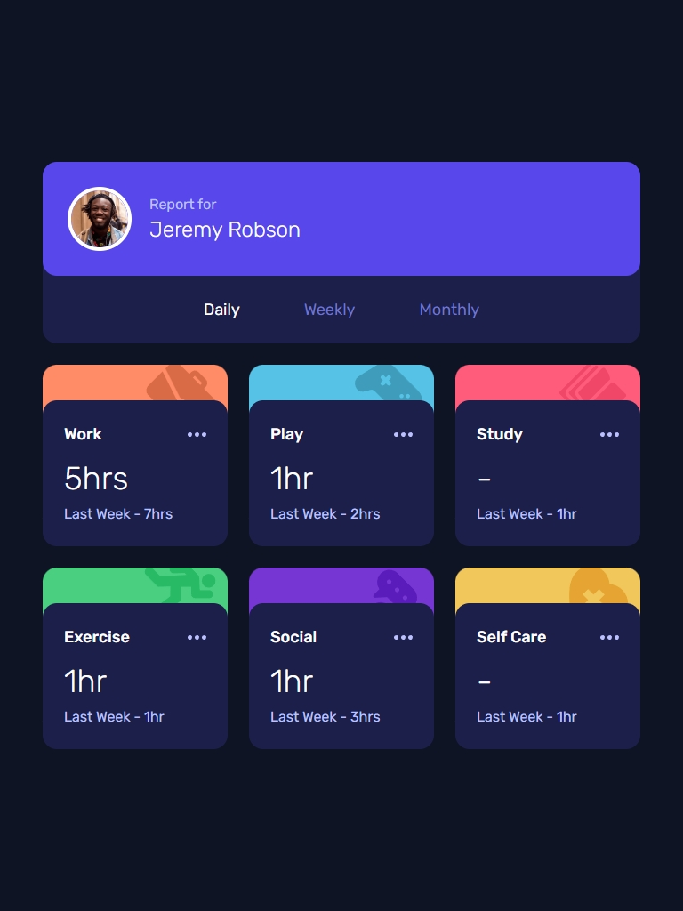
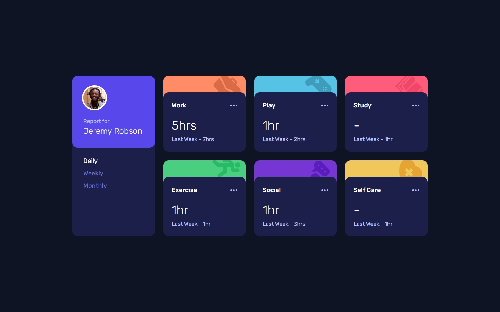

# Time Tracking Dashboard

A responsive dashboard for time tracking built with **React**, **Vite**, and **Tailwind CSS**.  
This project is a solution to the [Frontend Mentor Time Tracking Dashboard Challenge](https://www.frontendmentor.io/challenges/time-tracking-dashboard-UIQ7167Jw).

## LIVE SITE:

[](https://aflamiano-career.github.io/time-tracking-dashboard/)

---

## Table of contents

- [Overview](#overview)
  - [The Feature](#the-feature)
  - [Screenshots](#screenshots)
- [My process](#my-process)
  - [Built with](#built-with)
- [Acknowledgements](#acknowledgements)

---

## Overview

### The Feature

Users should be able to:

- Switch between viewing Daily, Weekly, and Monthly stats
- View the optimal layout for the site depending on their device's screen size
- See hover states for all interactive elements on the page

### Screenshots (Click to view larger)

  

---

## Built with

- Semantic HTML5 markup
- CSS custom properties
- Flexbox
- Mobile-first workflow
- [React](https://reactjs.org/) - Component-based JS library.
- [Tailwind CSS](https://tailwindcss.com/) - Utility-first CSS framework.
- [Vite](https://vitejs.dev/) - Fast and lean development build tool.
- JavaScript (ES6): Modern JavaScript features and best practices.

#### Sample code

```jsx
const [activities, setActivities] = useState([]);
const [timeframe, setTimeframe] = useState("daily");

useEffect(function () {
  async function getActivities() {
    try {
      const res = await fetch("../data/data.json");
      if (!res.ok) throw new Error("No response");
      const data = await res.json();
      setActivities(data);
    } catch (error) {
      console.error("Failed to fetch data", error);
    }
  }

  getActivities();
}, []);

function handleTimeframe(timeframe) {
  setTimeframe(timeframe);
}
```

---

## Acknowledgements

- [Frontend Mentor](https://www.frontendmentor.io/) for the challenge and design inspiration.

---
